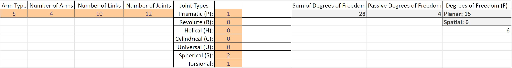

# MECA470_AgPods
### MECA 470 Robotic Engineering Project
----------------------------------------------------------------------------------

AgPods Project

  Project Members:
  Joseph Oliveri,
  Travis Bybee,
  Nick McConnell
  

  
  

   <h4> California State University Chico</h4>
   <h4> College of Mechanical and Mechatronic Engineering and Advance Manufacturing</h4> 
   <h4> MECA 470 Robotic Engineering</h4> 
   <h4> AgPods</h4> 

#### Table of Contents
- [1. Introduction](#1-Introduction)
- [2. Cable Robot Degrees Of Freedom](#2-Cable-Robot-Degrees-Of-Freedom)
- [3. Ineverse Kinematics](#3-Ineverse-Kinematics) 
- [4. CoppeliaSim Model](#4-CoppeliaSim-Model)
- [5. Appendix](#5-Appendix)
- [6. References](#6-References)

## 1. Introduction 
The goal of this project is to create an open hydroponic agriculture platform to streamline current systems that are inefficient and expensive. By utilizing an automated and low-cost concept, coupled with an AI robotic system, we aim to assist growers by tracking, identifying, and optimizing their growing recipes.

## 2. Cable Robot Degrees Of Freedom

By utilizing a 4-cable system robot, we are able to achieve a 6 degrees of freedom. We determined this by using Grubler's formula as seen below:

When inputting the variables for arms, links, joints, and calculating the DoF of the joints we recieved the spatial degree of freedom of 6. 

## 3. Ineverse Kinematics

The inverse Kinematics of this robot...

## 4. CoppeliaSim Model

The CoppeliaSim Model And explanation of Childscript...

## 5. Appendix 

A1:

A2:

## 6. References
[1]
